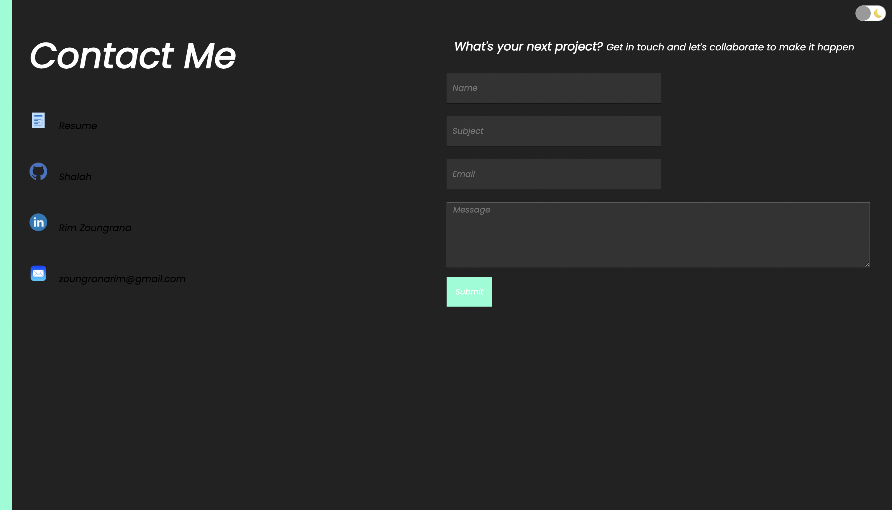

# Portfolio

## License

## Description
This is my portfolio that was built using REACT. It includes information about myself as well as languages and framework I have already learned. 

## Deployment
The application is displayed with GitHub pages [here](https://shalah.github.io/my-portfolio/)

## Installation 
After cloning this repository, there are few things that has to be done to make it your own. 

First, navigate to the package.json and change the homepage property to match your your own github url. Then run the command: `npm install` or `npm i` for short, as well as the command `npm start` which will launch the app. 

Furthermore, you will have to create an account for `Emailjs`. You will be provided with a `service id`, a `template id` and a `public key` which you will need to input in `Contact.jsx` in order to receive the emails sent for you. If this is not done, I will be receiving emails that were intented for you. 

## My Information
- Rim Zoungrana
- github.com/Shalah

